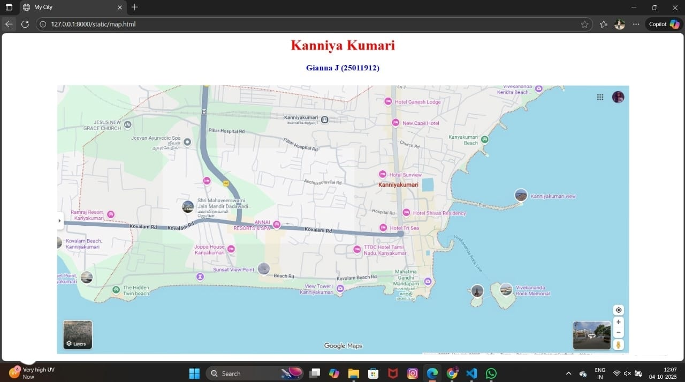
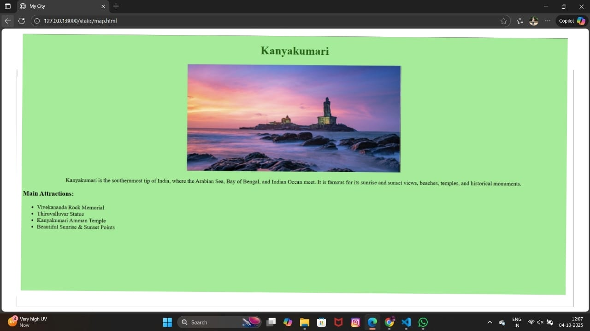
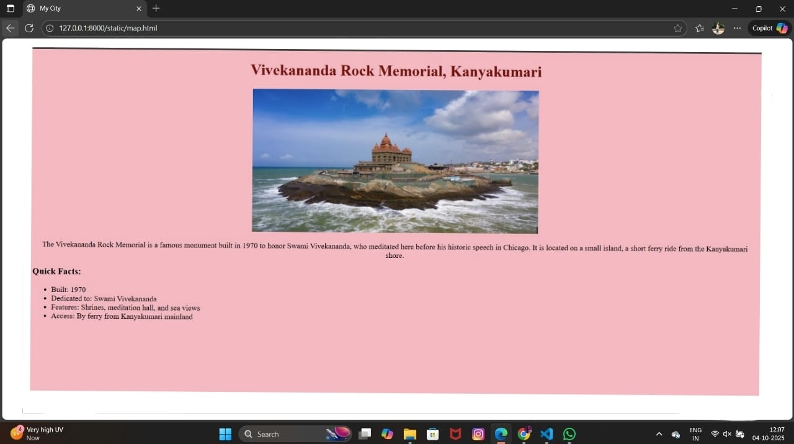
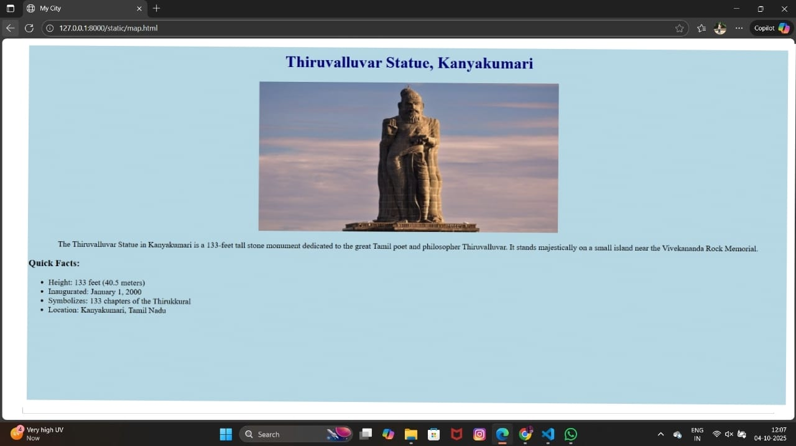
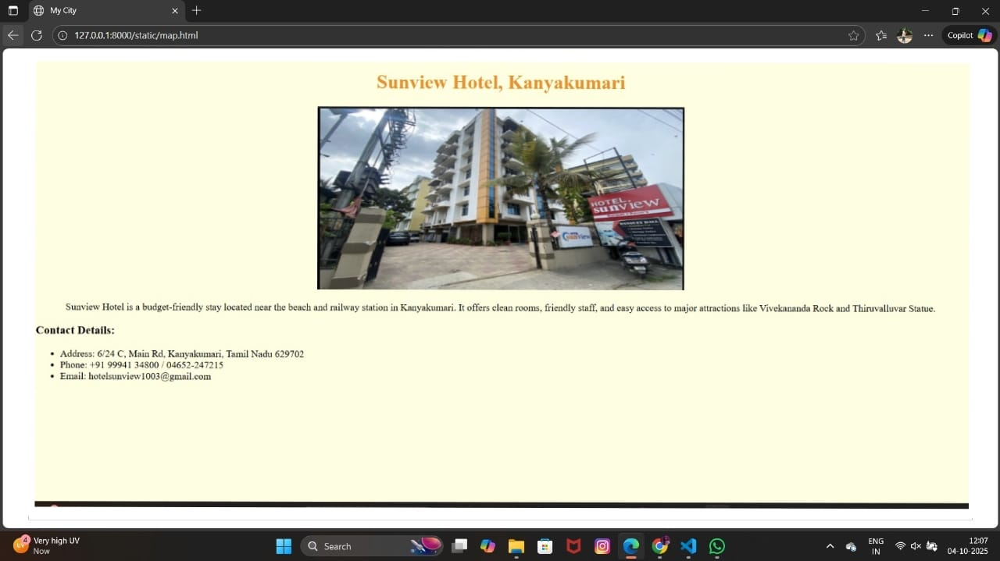
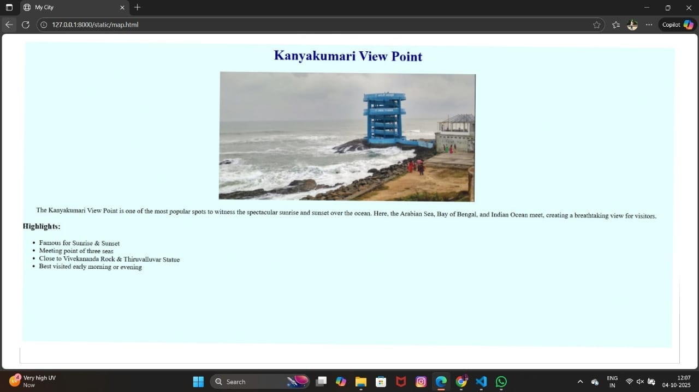

# Ex04 Places Around Me
# Date:
# AIM
To develop a website to display details about the places around my house.

# DESIGN STEPS
## STEP 1
Create a Django admin interface.

## STEP 2
Download your city map from Google.

## STEP 3
Using <map> tag name the map.

## STEP 4
Create clickable regions in the image using <area> tag.

## STEP 5
Write HTML programs for all the regions identified.

## STEP 6
Execute the programs and publish them.

# CODE
```
map.html

<html>
<head>
    <title>My City</title>
</head>

<body>
    <h1 align="center">
        <font color="red"><b>Kanniya Kumari</b></font>
    </h1>

    <h3 align="center">
        <font color="blue"><b>Gianna J (25011912)</b></font>
    </h3>

    <center>
        

        <map name="MyCity">
            <area shape="rect" coords="300,700,800,250" href="home.html" title="Kanniya Kumari">
            <area shape="rect" coords="1600,300,400,900" href="vivekananda.html" title="Vivekananda rock">
            <area shape="rect" coords="1500,400,250,700" href="thiruvalluvar.html" title="Thiruvalluvar statue">
            <area shape="rect" coords="700,100,900,900" href="hotel.html" title="sunview hotel">
            <area shape="rect" coords="1000,100,200,900" href="view.html" title="View point">
        </map>
    </center>
</body>
</html>

home.html

<!DOCTYPE html>
<html lang="en">
<head>
  <meta charset="UTF-8">
  <title>Kanyakumari - My Hometown</title>
</head>
<body bgcolor="lightgreen">
  <h1 align="center" style="color:darkgreen;">Kanyakumari</h1>
  <center>
    
  </center>
  <p align="center">
    Kanyakumari is the southernmost tip of India, where the Arabian Sea, Bay of Bengal, 
    and Indian Ocean meet. It is famous for its sunrise and sunset views, beaches, 
    temples, and historical monuments.
  </p>
  <h3>Main Attractions:</h3>
  <ul>
    <li>Vivekananda Rock Memorial</li>
    <li>Thiruvalluvar Statue</li>
    <li>Kanyakumari Amman Temple</li>
    <li>Beautiful Sunrise & Sunset Points</li>
  </ul>
</body>
</html>

vivekananda.html

<!DOCTYPE html>
<html lang="en">
<head>
  <meta charset="UTF-8">
  <title>Vivekananda Rock Memorial - Kanyakumari</title>
</head>
<body bgcolor="lightpink">
  <h1 align="center" style="color:maroon;">Vivekananda Rock Memorial, Kanyakumari</h1>
  <center>
    
  </center>
  <p align="center">
    The Vivekananda Rock Memorial is a famous monument built in 1970 to honor 
    Swami Vivekananda, who meditated here before his historic speech in Chicago.  
    It is located on a small island, a short ferry ride from the Kanyakumari shore.
  </p>
  <h3>Quick Facts:</h3>
  <ul>
    <li>Built: 1970</li>
    <li>Dedicated to: Swami Vivekananda</li>
    <li>Features: Shrines, meditation hall, and sea views</li>
    <li>Access: By ferry from Kanyakumari mainland</li>
  </ul>
</body>
</html>

thiruvalluvar.html

<!DOCTYPE html>
<html lang="en">
<head>
  <meta charset="UTF-8">
  <title>Thiruvalluvar Statue - Kanyakumari</title>
</head>
<body bgcolor="lightblue">
  <h1 align="center" style="color:navy;">Thiruvalluvar Statue, Kanyakumari</h1>
  <center>
    
  </center>
  <p align="center">
    The Thiruvalluvar Statue in Kanyakumari is a 133-feet tall stone monument dedicated 
    to the great Tamil poet and philosopher Thiruvalluvar.  
    It stands majestically on a small island near the Vivekananda Rock Memorial.
  </p>
  <h3>Quick Facts:</h3>
  <ul>
    <li>Height: 133 feet (40.5 meters)</li>
    <li>Inaugurated: January 1, 2000</li>
    <li>Symbolizes: 133 chapters of the Thirukkural</li>
    <li>Location: Kanyakumari, Tamil Nadu</li>
  </ul>
</body>
</html>

hotel.html

<!DOCTYPE html>
<html lang="en">
<head>
  <meta charset="UTF-8">
  <title>Sunview Hotel - Kanyakumari</title>
</head>
<body bgcolor="lightyellow">
  <h1 align="center" style="color:darkorange;">Sunview Hotel, Kanyakumari</h1>
  <center>
    
  </center>
  <p align="center">
    Sunview Hotel is a budget-friendly stay located near the beach and railway station in Kanyakumari.  
    It offers clean rooms, friendly staff, and easy access to major attractions like Vivekananda Rock and Thiruvalluvar Statue.
  </p>
  <h3>Contact Details:</h3>
  <ul>
    <li>Address: 6/24 C, Main Rd, Kanyakumari, Tamil Nadu 629702</li>
    <li>Phone: +91 99941 34800 / 04652-247215</li>
    <li>Email: hotelsunview1003@gmail.com</li>
  </ul>
</body>
</html>

view.html 

<!DOCTYPE html>
<html lang="en">
<head>
  <meta charset="UTF-8">
  <title>Kanyakumari View Point</title>
</head>
<body bgcolor="lightcyan">
  <h1 align="center" style="color:darkblue;">Kanyakumari View Point</h1>
  <center>
    
  </center>
  <p align="center">
    The Kanyakumari View Point is one of the most popular spots to witness 
    the spectacular sunrise and sunset over the ocean.  
    Here, the Arabian Sea, Bay of Bengal, and Indian Ocean meet, 
    creating a breathtaking view for visitors.
  </p>
  <h3>Highlights:</h3>
  <ul>
    <li>Famous for Sunrise & Sunset</li>
    <li>Meeting point of three seas</li>
    <li>Close to Vivekananda Rock & Thiruvalluvar Statue</li>
    <li>Best visited early morning or evening</li>
  </ul>
</body>
</html>

```
# OUTPUT








# RESULT
The program for implementing image maps using HTML is executed successfully.
